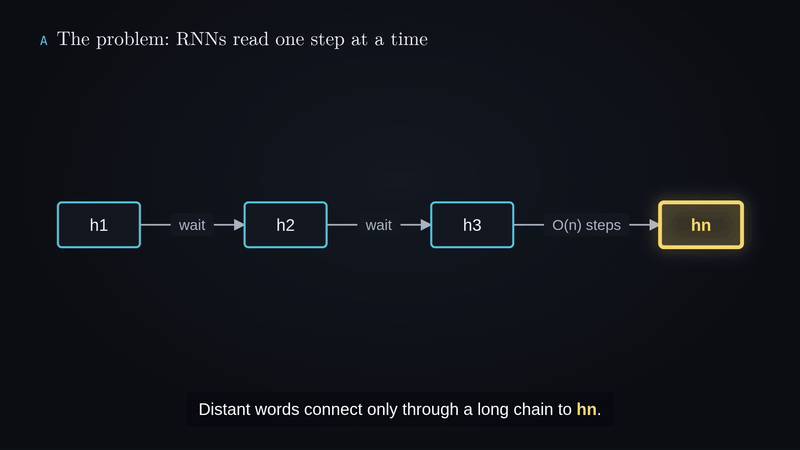

# papergit2video

**Turn research papers and GitHub repos into narrated explainer videos, with one prompt.**

Give your AI coding agent an arXiv link, a PDF, a GitHub repo or a local codebase. papergit2video reads it, writes a script for the audience you pick, draws animated diagrams and charts, narrates them with a natural voice, and exports an MP4. It can also make an interactive one-page explainer instead of a video.

Everything runs on your machine: no API keys and no cloud TTS, and the source never leaves your computer.

<p align="center"><a href="https://github.com/HuiMa-pty/papergit2video/releases/download/v1.0.0/papergit2video-demo.mp4"></a><br>
<sub>A real Claude Code session, with long pauses shortened: one prompt, four questions, and a narrated video in about two minutes on one GPU. <a href="https://github.com/HuiMa-pty/papergit2video/releases/download/v1.0.0/papergit2video-demo.mp4">Watch it as an MP4</a>, ending with a clip of the video it made.</sub></p>

## What you get

| | |
|---|---|
| **Sources** | arXiv papers, PDFs, GitHub repositories, local source code |
| **Output** | Narrated 1080p MP4 with subtitles, plus an HTML player, or an interactive one-page explainer |
| **Styles** | 3Blue1Brown-style dark, Blueprint, Clean cards, or Interactive page |
| **Audience** | Middle school, high school, college, expert/researcher |
| **Languages** | English, Mandarin Chinese, Japanese (male narrator; English terms read correctly inside Chinese) |
| **Diagrams** | Flowcharts, sequence diagrams, trees, timelines, bar charts, tables, with camera zoom on what the narrator names |
| **Privacy** | Local neural TTS ([Kokoro](https://huggingface.co/hexgrad/Kokoro-82M)); nothing is uploaded |
| **Speed** | NVIDIA GPU detected automatically: narration, frame drawing and encoding all run on CUDA |

## Example output

The video below is what papergit2video made in the demo session above, from one prompt: "Make a one-minute explainer video of https://arxiv.org/abs/1706.03762" (English, 3Blue1Brown dark, college level).

<p align="center"><a href="https://github.com/HuiMa-pty/papergit2video/releases/download/v1.0.0/example-attention-is-all-you-need.mp4"></a><br>
<sub><a href="https://github.com/HuiMa-pty/papergit2video/releases/download/v1.0.0/example-attention-is-all-you-need.mp4">Watch the full narrated video (MP4, about 1 minute)</a></sub></p>

**What it cost:** that session made 15 Claude Opus 5.5 API calls in about 2 minutes. That's 32 uncached input tokens, 43,839 cache-write tokens, 644,789 cache-read tokens and 5,906 output tokens, or **about $0.47** at list prices ($4 input, $5 cache write, $0.20 cache read, $20 output per million tokens). Narration, drawing and encoding run on your machine and use no API tokens. Longer videos and repos cost more.

## Install

Pick your app. Every option installs the same skill.

### Claude Code: CLI, and the Code tab in the Claude desktop app

```text
/plugin marketplace add HuiMa-pty/papergit2video
/plugin install papergit2video@papergit2video
```

### Codex: CLI, desktop app and IDE extension

```bash
codex plugin marketplace add HuiMa-pty/papergit2video
codex plugin add papergit2video@papergit2video
```

In the Codex desktop app, open **Plugins**, add the marketplace `HuiMa-pty/papergit2video`, and install **papergit2video**.

### Cursor: editor and `cursor-agent`

- **Editor:** Settings → **Plugins** → **Import**, then paste `https://github.com/HuiMa-pty/papergit2video`.
- **CLI:** run `cursor-agent plugin marketplace add https://github.com/HuiMa-pty/papergit2video`, then type `/plugin` in `cursor-agent` and install it from the **Marketplace** tab.

### Claude desktop and web app (chat)

Download `papergit2video.zip` from the [latest release](https://github.com/HuiMa-pty/papergit2video/releases/latest), then go to **Settings → Capabilities → Skills → Upload skill**.

> Chat skills run in Claude's cloud sandbox. That sandbox has no GPU, and it may not be able to download the voice model, a browser or ffmpeg, so full video rendering may not work there. For videos, use Claude Code (CLI or the desktop app's Code tab), Codex or Cursor, which run on your machine.

### Any other agent, or a manual install

```bash
npx skills add HuiMa-pty/papergit2video          # interactive installer for most coding agents
# or copy the skill folder yourself:
git clone https://github.com/HuiMa-pty/papergit2video
cp -r papergit2video/skills/papergit2video ~/.claude/skills/    # Codex: ~/.codex/skills/  Cursor: ~/.cursor/skills/
```

## Use it

```text
> Make an explainer video of https://arxiv.org/abs/2609.37725
> Explain https://github.com/<user>/<repo> as a video for college students
> Turn this codebase into an interactive one-page explainer
```

The agent asks four questions (language, style, audience, output folder), then does the rest. The first run sets up the voice model and tools, about 3 GB. Run `skills/papergit2video/scripts/setup.sh` yourself to do that ahead of time.

## Requirements

- Linux (tested on Ubuntu, x86-64) or macOS (Apple Silicon or Intel; the scripts run on the default bash 3.2)
- Python 3.12 with [uv](https://docs.astral.sh/uv/), Node.js 22+, ffmpeg with libx264 (macOS: `brew install ffmpeg`)
- A headless Chromium. Setup installs one with Playwright if none is found; on macOS an installed Google Chrome also works.
- Optional: an NVIDIA GPU (Linux). Setup then installs CUDA torch and an NVENC-capable ffmpeg. On macOS everything runs on the CPU.

## How fast is it?

Measured on an AWS g4dn.2xlarge (8 vCPU, NVIDIA T4), exporting 143 s of video:

| Pipeline | Time | Speed-up |
|---|---:|---:|
| One frame at a time, CPU encoder | 379 s | 1× |
| 4 parallel workers, CPU encoder | 140 s | 2.7× |
| 8 workers, GPU drawing + NVENC (default with a GPU) | 69 s | 5.5× |

A full 10-minute video (narration for 67 lines plus export) takes about 6 minutes on the T4.

## How it works

1. **Read:** the agent reads the whole paper, or the README, docs and core modules of a repo.
2. **Script:** it writes a Markdown draft. Each scene is one diagram plus 3–6 spoken lines, and every number comes from the source. A style check keeps sentences short and active, and a subtitle check keeps captions from covering the diagram.
3. **Narrate:** Kokoro speaks every line through a warm local server, on CUDA when available.
4. **Animate and export:** a headless browser draws each frame. Parallel workers split the timeline, NVENC encodes, and the segments are joined frame-exactly. Audio is normalized to −14 LUFS.

## Configuration

| Variable | Default | Purpose |
|---|---|---|
| `PAPER_VIDEO_HOME` | `~/.papergit2video` | Voice model, caches, work dirs and outputs |
| `PAPER_VIDEO_GPU` | `auto` | `off` forces the CPU path |
| `PAPER_VIDEO_VOICE_EN` / `_ZH` / `_JA` | `am_michael` / `zm_010` / `jm_kumo` | Narrator voices (any Kokoro voice) |
| `PAPER_VIDEO_SPEED` | `1.0` | Speaking rate |
| `AM_EXPORT_WORKERS` | auto | Parallel export workers |
| `AM_BRAND` | `Paper Explainer` | Credit shown on the title card and in page footers |

## License

MIT; see [LICENSE](LICENSE). Bundled and downloaded third-party components keep their own licenses; see [THIRD_PARTY_NOTICES.md](THIRD_PARTY_NOTICES.md).
